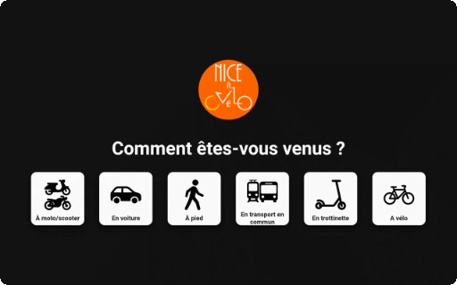
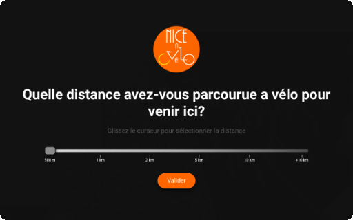
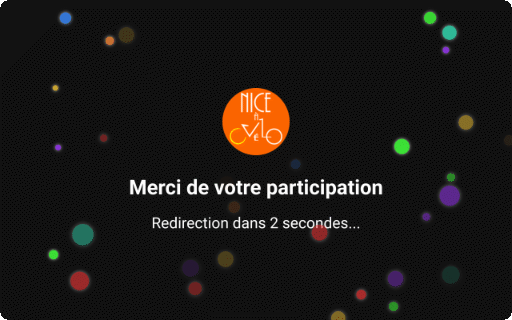
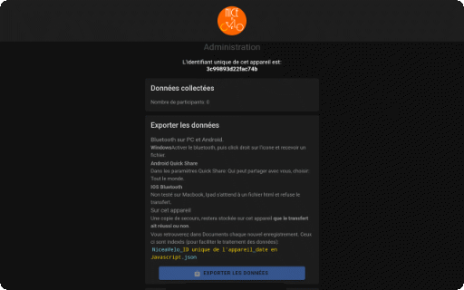

# Survey Application for Interactive Kiosk

**Nice a vélo** is a simple project for collecting information on urban mobility usage, using recycled Android tablets as interactive kiosks.

These kiosks are placed with partners, and individuals can answer the question, "How did you get here?". Participants then estimate the distance traveled, and a thank-you screen is displayed before returning to the question for the next participant.

Data is collected on the device, with organizers able to retrieve it regularly via Bluetooth at the kiosk's location.

Created for  [Nice à Vélo Association](https://niceavelo.org), there is also a Raspberry Pi-based kiosk version, which will be added here (currently available upon request).

## Features

-**Independence:** No network required, kiosks can be placed and used as is.

-**Data export:** Via Quick Share or Bluetooth by organizers.

-**Data backup:** In the device's Documents directory.

-**Customizable:** Want to conduct a similar survey in your city? Change the logo by placing a PNG image (200x200px) at:
`src\assets\img\logo.png`

Please [let us know](https://niceavelo.org/?pagename=contact) if you are using this app at your location. We, the cyclists are the critical mass all other the world!

-**Adaptable:** A simple project that facilitates adding pages to the questionnaire.

-**Data processing:** Each device is identifiable in data file for easier processing.

## Interface

**Home:**
Main question and response choices.
Questions are distributed randomly.

**Distance**
Participants estimate the distance traveled.

**Thank You**
Thank-you page with animation.

**Administration:**
Allows data to be collected in JSON format, stored in the device's "Documents" folder, and resets local data storage.

To access the administration screen: tap the logo on the home page.
Username: `admin` Password: `admin123`

It is recommended to modify these credentials in the file:
`/src/app/admin/admin.page.ts`

## Installation

### APK
The APK generated from these files is available at:
`apk/niceavelo-v0.apk`

### Environnement
Pre-requisites: Install Visual Studio and Android Studio.

1. Install the Ionic extension in VS Code.
2. Download the ZIP or clone the repository.
3. Open the project in MS Visual Code
   The Ionic extension will use the package.json file to update the modules.
4. If needed, in the Ionic extension panel:
1. Installer l'extension Ionic dans VS Code.
2. Télécharger le zip ou cloner le dépot.
3. Ionic, utilisera le fichier package.json pour mettre à jour les modules utilisés.
4. Si besoin dans le panneau de l'extension Ionic: 
  - Add Angular Project
  - Add Android Project

### Ionic Extension Panel (VS Code)
Run the following scripts from the menu:

1. `ng` (after installation)
2. `build` (after installation)
3. `copy-android` (after installation)
4. `build-sync` (after installation and after modifying source files)
5. Open in Android Studio

### Android Studio
1. Build > Compile all Sources
2. Build > Generate App Bundles or APKS > Generates APKs

**Note :**
Ionic allows this app to be used on iPads, provided you have a macOS computer (Ionic > Add iOS Project).

## Future Development

1. Python scripts for data processing and presentation.
2. Raspberry Pi kiosk mode (Python/Flask) with automated data collection via secure USB key (currently available upon request), with integrated display on the device (screen on the Raspberry Pi) or Wi-Fi access point.

## Licence

This project is licensed under [Creative Commons Attribution-NonCommercial 4.0 International (CC BY-NC 4.0)](https://creativecommons.org/licenses/by-nc/4.0/deed.en).  
You are free to share and adapt this content, provided that you credit the author and do not use it for commercial purposes.

**For commercial use***, please, ✉️ [contact the author](mailto:thierry.grandsart@free.fr).

## Contact

You want to contribute or have questions, : ✉️ [e-mail me](mailto:thierry.grandsart@free.fr).