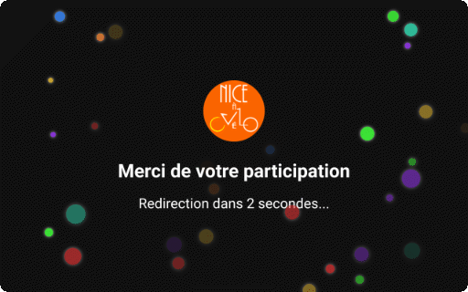

# Application de sondage pour borne interactive

**Nice a vélo** est un projet simple de collecte d'information sur les usages de mobilité en milieu urbain, au moyen de tablettes Android de récupération utilisées comme des bornes interactives.

Celles-ci sont déposées chez des partenaires et les personnes qui le souhaitent peuvent répondre à la question "Comment êtes-vous venus ?". Puis évaluent la distance parcourue et un écran de remerciement est présenté, avant de revenir à la question pour le participant suivant.

Les données sont recueillies sur l'appareil avec pour les organisateurs la possibilité de régulièrement les collecter par Bluetooth sur le lieu de dépôt de la borne.

Réalisé pour  [l'association Nice à vélo](https://niceavelo.org), il en existe aussi une version pour borne basée sur raspberry pi, qui sera ajoutée ici (entretemps disponible sur demande).

## Fonctionnalités

-**Indépendance:** Aucun réseau requis, les bornes peuvent être déposées et utilisées tel quel.

-**Export des données:** par Quick Share ou Bluetooth par les organisateurs.

-**Sauvegarde des données:** dans le répertoire Documents de l'appareil.

-**Personnalisable:** Vous désirez mener ce même type d'enquête dans votre ville, changez le logo en placant une image png (200x200px):
`src\assets\img\logo.png`

Merci de [nous informer](https://niceavelo.org/?pagename=contact), si vous utiliser cette app dans votre ville. Nous, les cyclistes sommes la masse critique partout dans le monde! 

-**Adaptable:** Projet très simple, ce qui facilite l'ajout de pages au questionnaire.

-**Traitement des données:** L'appareil est identifiable dans chaque fichier de donnée, pour faciliter le traitement.

## Interface

**Home:** Question principale et choix de réponses.
Les questions sont distribuées aléatoirement.

**Distance:** Le participant estime la distance parcourue.

**Remerciement:** Page de remerciement avec animation.

**Administration** Permet de recueillir les données au format JSON de l'enregistrer dans le dossier "Documents" de l'appareil et de réinitialise le stockage local des données.

Pour accéder à l'écran d'administration: toucher le logo sur la page d'accueil.
Utilisaterur: `admin`
Mot de passe: `admin123`

Il est recommandé de les modifier dans le fichier: 
`/src/app/admin/admin.page.ts`

## Installation

### APK
L'apk générée à partir de ces fichiers est disponible:
`apk/niceavelo-v0.apk`

### Environnement
Au préalable: installer Visual Studio et Android Studio.

1. Installer l'extension Ionic dans VS Code.
2. Télécharger le zip ou cloner le dépot.
3. Ouvrir le dossier du projet dans Visual Code
   L'extension Ionic, utilisera le fichier package.json pour mettre à jour les modules utilisés.
4. Si besoin dans le panneau de l'extension Ionic: 
  - Add Angular Project
  - Add Android Project

### Panneau de l'extension Ionic (VS Code)
Lancer à partir du menu Scripts:
1. `ng`  (après l'intallation)
2. `build` (après l'intallation)
3. `copy-android` (après l'intallation)
4. `build-sync` (après l'intallation et à chaque modification des sources)
5. Open in Android Studio

### Android Studio
1. Build > Compile all Sources
2. Build > Generate App Bundles or APKS > Generates APKs

**Note :**
Ionic permet d'utiliser cette appli pour Ipad à condition d'avoir un ordi IOS (Ionic > Add iOS Project).

## A venir

1. Scripts Python de traitement et de présentation des données
2. Mode borne Raspberry (Python/Flask) avec fonctionalité de collecte automatisé par clé USB sécurisée (Actuellement disponible sur demande), avec display intégrée à l'appareil (écran sur le raspberry) ou par accès Wi-Fi en AP.

## Licence

Ce projet est sous licence [Creative Commons Attribution-NonCommercial 4.0 International (CC BY-NC 4.0)](https://creativecommons.org/licenses/by-nc/4.0/deed.fr).  
Vous êtes libre de partager et d'adapter ce contenu, à condition de créditer l'auteur et de ne pas l'utiliser à des fins commerciales.

**Pour toute utilisation à visée commerciale**, ✉️ [prenez contact avec l'auteur](mailto:thierry.grandsart@free.fr).

## Contact

Si vous avez des questions ou souhaitez contribuer: ✉️ [contactez-moi](mailto:thierry.grandsart@free.fr).